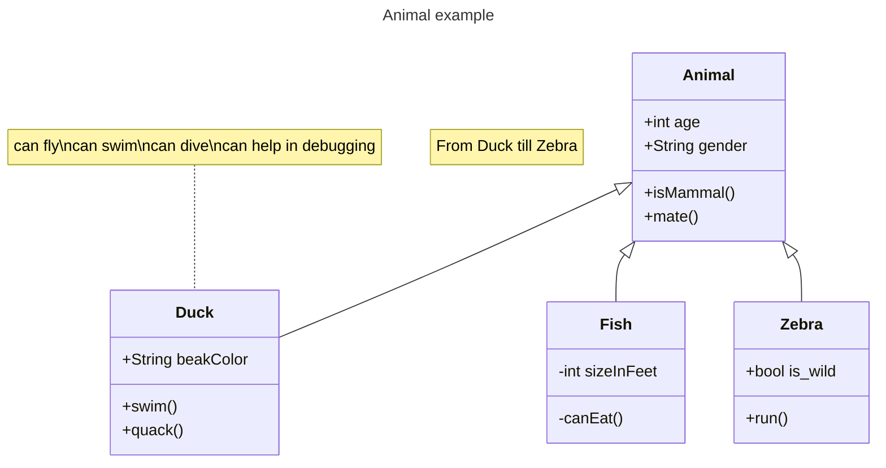

This is only a test.

<!--more-->

# Heading 1
This is some text in a long paragraph

- Item 1
- Item 2
- Item 3

## Heading 2
This is some text in a long paragraph

1. Item 1
2. Item 2
3. Item 3

### Heading 3
This is some more long text in a paragraph

```csharp
public void DoSomething()
{
    //Hello world
}
```


